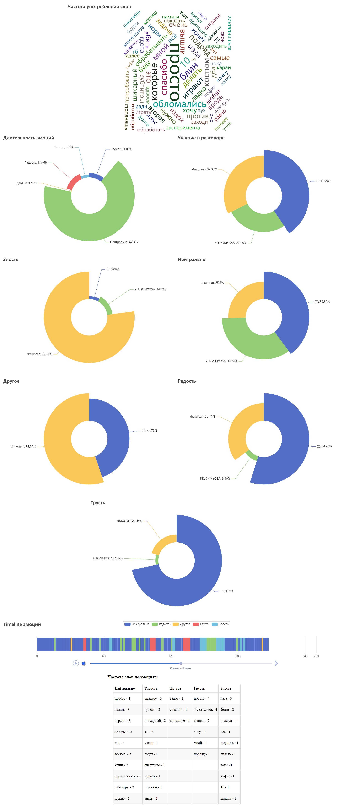

# SoulSense - Discord-бот для распознавания речи и эмоций  

## :page_with_curl: Содержание

➠ [Сервисы](#globe_with_meridians-сервисы)

➠ [Технологический стек](#computer-технологический-стек)

➠ [Запуск приложения](#technologist-запуск-приложения)

➠ [Пример отчета](#bar_chart-пример-отчета)

## :globe_with_meridians: Сервисы

### [Discord-бот](https://github.com/KELONMYOSA/soulsense_discord_bot)

- [x] **Обнаружение эмоций**: бот Discord использует методы обработки естественного языка для анализа речи участников и обнаруживает основные эмоции, такие как счастье, печаль, гнев и т. д.
- [x] **Анализ тональности**: бот выполняет анализ тональности сообщений, чтобы определить общую тональность, выраженную в беседе. Это помогает отслеживать, является ли разговор в основном положительным, отрицательным или нейтральным.
- [x] **Анализ эмоциональных реакций**: бот оценивает эмоциональные реакции участников на определенные события или сообщения. Он выявляет закономерности в эмоциональных реакциях и дает представление о том, как участники реагируют на различные темы или обсуждения.
- [x] **Отслеживание эмоциональных тенденций**: бот отслеживает эмоциональные тенденции во время разговора. Он выявляет любые сдвиги в эмоциях и предоставляет отчет, чтобы помочь понять эмоциональную динамику обсуждения.
- [x] **Персонализированная эмоциональная информация**: Бот может предоставить участникам персонализированную эмоциональную информацию, помогая им лучше понять свои собственные эмоции и то, как они влияют на общий эмоциональный климат беседы.

### [Распознавание речи](https://github.com/KELONMYOSA/soulsense_speech2text)

- [x] **Декодирование речи**: Веб-служба на основе Whisper использует усовершенствованные алгоритмы для декодирования и интерпретации речи, точно преобразовывая ее в письменный текст.
- [x] **Возможность масштабтрования**: Веб-служба может использовать CPU или GPU гарантируя, что речь будет декодирована и преобразована в текст на любом оборудовании, а использование мощного железа предоставит возможность обработки в режиме реального времени.
- [x] **Интеграция и доступность**: Сервис предоставляет API, что позволяет легко встраивать его в различные приложения и платформы. Это обеспечивает доступность и совместимость на разных устройствах и операционных системах, что делает его широко доступным для пользователей.

### [Распознавание эмоций](https://github.com/KELONMYOSA/soulsense_emotion_recognition)

- [x] **Анализ текста**: Веб-служба выполняет анализ тональности текстовых данных, чтобы распознавать эмоции, выраженные в письменной форме. Он может идентифицировать определенные эмоции, такие как счастье, печаль, гнев и т. д.
- [x] **Анализ речи**: Служба способна анализировать речевые данные для распознавания эмоций, выраженных в тоне и интонации голоса говорящего. Он может распознавать эмоции, анализируя акустические особенности и речевые паттерны.
- [x] **Мультимодальное распознавание эмоций**: Сервис объединяет анализ текста и речи, чтобы обеспечить более полное понимание эмоций. Он может одновременно анализировать как письменный контент, так и аудиоданные, чтобы идентифицировать и анализировать эмоции, выраженные через оба носителя.
- [x] **Распознавание эмоций в режиме реального времени**: Веб-служба способна выполнять распознавание эмоций в режиме реального времени, обеспечивая мгновенный анализ и реагирование. Эта функция может быть полезна в таких приложениях, как обслуживание клиентов, исследования рынка или мониторинг социальных сетей, где требуется немедленное обнаружение эмоций.

## :computer: Технологический стек

<p align="center">


</p>

[**Discord-бот**](https://github.com/KELONMYOSA/soulsense_discord_bot)

> В качестве библиотеки для взаимодействия с Discord API используется <code>Pycord</code>.
> 
> Записанная речь обрабатывается c помощью <code>pydub</code>.
>
> <code>pyecharts</code> визуализирует данные для отчета в HTML.

[**Распознавание речи**](https://github.com/KELONMYOSA/soulsense_speech2text)

> <code>FastAPI</code> используется для создания API-сервера со встроенной валидацией, сериализацией и асинхронностью.
> 
> Для преобразования речи в текст используется модель <code>OpenAI Whisper</code>.
>
> Для лучшей работы на CPU используется библиотека <code>pywhispercpp</code>.

[**Распознавание эмоций**](https://github.com/KELONMYOSA/soulsense_emotion_recognition)

> <code>FastAPI</code> используется для создания API-сервера.
> 
> Модели для распознавания эмоций запускаются с помощью <code>HuggingFace Transformers</code> и <code>PyTorch</code>.
> 
> Для анализа речи используется модель <code>[wav2vec2-xls-r-300m-emotion-ru](https://github.com/KELONMYOSA/wav2vec2-xls-r-300m-emotion-ru)</code>.
>
> Для анализа текста используется модель <code>[rubert-tiny2-cedr-emotion-detection](https://huggingface.co/cointegrated/rubert-tiny2-cedr-emotion-detection)</code>.

## :technologist: Запуск приложения

### Переменные окружения

[**Discord-бот**](https://github.com/KELONMYOSA/soulsense_discord_bot)

```
BOT_TOKEN - Токен вашего Discord бота
BOT_PREFIX - Префикс для команд бота
RECOGNITION_URL - Адрес сервера и порт для распознавания речи 
EMOTION_URL - Адрес сервера и порт для распознавания эмоций 
```

[**Распознавание речи**](https://github.com/KELONMYOSA/soulsense_speech2text)

<pre>
WHISPER_MODEL - Используемая модель Whisper, для whisper.cpp модели доступны в <a href="https://huggingface.co/ggerganov/whisper.cpp">репозитории</a>
WHISPER_THREADS - Количество потоков, по умолчанию равно min(4, доступно)
WHISPER_LANGUAGE - Язык распознаваемой речи, для автоматического определения "" или "auto"
WHISPER_DEVICE - Используемое устройство "cpu" или "cuda"
</pre>

### Запуск в Docker

[**Discord-бот**](https://github.com/KELONMYOSA/soulsense_discord_bot)

Сборка образа из Dockerfile - <code>docker build --no-cache -t soulsense_discord_bot .</code>

Запуск контейнера - <code>docker run -d --net=host --name soulsense_discord_bot soulsense_discord_bot</code>

[**Распознавание речи**](https://github.com/KELONMYOSA/soulsense_speech2text)

Сборка образа из Dockerfile - <code>docker build --no-cache -t soulsense_speech2text .</code>

Запуск контейнера - <code>docker run -d -p 8000:8000 --name soulsense_speech2text soulsense_speech2text</code>

[**Распознавание эмоций**](https://github.com/KELONMYOSA/soulsense_emotion_recognition)

Сборка образа из Dockerfile - <code>docker build --no-cache -t soulsense_emotion_recognition .</code>

Запуск контейнера - <code>docker run -d -p 7000:7000 --name soulsense_emotion_recognition soulsense_emotion_recognition</code>

## :bar_chart: Пример отчета

> После завершения анализа бот отправляет отчет в формате HTML по всем участникам разговора и по каждому отдельному участнику.

<p align="center">
  
</p>

--------------------------------------------------------------------------  
Copyright © 2023 **KELONMYOSA**.  
Licensed under the Apache License, Version 2.0